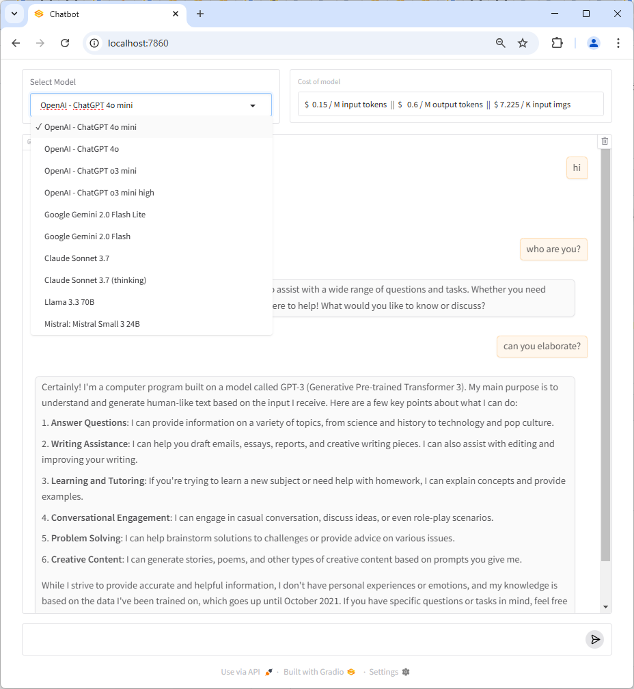

# Introduction

This is a simple chatbot with model selection for users with OpenRouter API access.



# Usage

```
git clone https://github.com/aa-crypto-ai/basic-chatbot.git
cd basic-chatbot
mkdir ~/.ai-agent-key
cp sample.env ~/.ai-agent-key/master.env
# put your OpenRouter API key to master.env
docker-compose up --build
```

Then you can access the chatbot at http://localhost:7860/chatbot. Note that the port number is fixed with this implementation.
