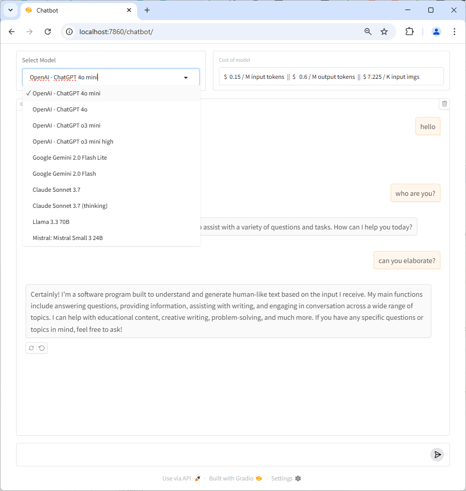

# Introduction

This is a secure chatbot with user authentication and model selection for users with OpenRouter API access.



# Features

- 🔐 User authentication with login/registration
- 🤖 Multiple AI model selection
- 💰 Real-time cost display for different models
- 🔒 Session-based access control
- 📱 Responsive web interface

# Usage

```bash
git clone https://github.com/aa-crypto-ai/basic-chatbot.git
cd basic-chatbot
mkdir ~/.ai-agent-key
cp sample.env ~/.ai-agent-key/master.env
# Edit ~/.ai-agent-key/master.env and add your OpenRouter API key and secret key
docker-compose up --build
```

## Configuration

Edit `~/.ai-agent-key/master.env` file:

```env
# Your OpenRouter API key
OPENROUTERAI_API_KEY="your-openrouter-api-key-here"

# Secret key for JWT tokens - change this in production!
SECRET_KEY="your-very-long-random-secret-key-here"
```

## Access

1. Open your browser and go to http://localhost:7860
2. You'll be redirected to the login page
3. Create a new account or log in with existing credentials
4. Once authenticated, you'll have access to the chatbot interface

## First Time Setup

1. Go to http://localhost:7860
2. Click "Create Account" on the login page
3. Fill in your username and password (email is optional)
4. Click "Create Account" to register
5. Log in with your new credentials
6. Start chatting with your selected AI model!

## Security Features

- JWT-based authentication with secure cookies
- Password hashing using bcrypt
- Session timeout (30 minutes by default)
- Protected routes - unauthenticated users are redirected to login
- User data stored locally in JSON format

Note: The port number is fixed at 7860 with this implementation.
